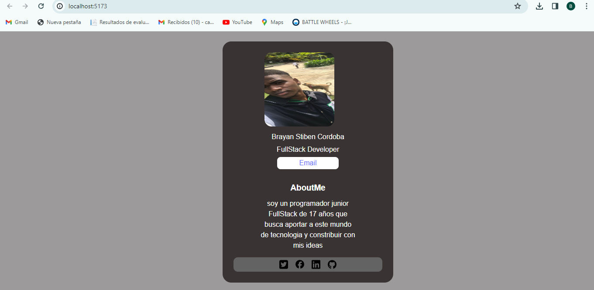

Estructura de Componentes
Avatar Component (Avatar.jsx):

Utiliza una imagen circular.
Importa estilos desde 'Avatar.css'.
MyInfo Component (MyInfo.jsx):

Contiene información personal y profesional.
Estilos centrados usando la clase 'MyInfo'.
SocialNetwork Component (SocialNetworks.jsx):

Contiene botones de redes sociales.
Estilos centrados usando la clase 'SocialNetwork'.

AboutMe Component (AboutMe.jsx):

Describe al programador junior.
Estilos centrados usando la clase 'AboutMe'.
Estilo Global (App.css)
Centra todos los elementos utilizando el contenedor principal con la clase 'container-general'.
Estilos generales para mejorar la apariencia y legibilidad.

Estilo del Footer (Footer.css)

Componente Footer con íconos de redes sociales.
Utiliza flexbox para alinear los íconos uno al lado del otro.
Establece un color de fondo y texto.

Uso en App Component (App.jsx)

Importa y utiliza los componentes mencionados.
Estructura general centrada con la clase 'container-general'.

Notas
Ajusta tamaños, colores y márgenes según tus preferencias.
Los estilos se aplican a través de archivos CSS específicos para cada componente.

Comandos :
 Npm i -> para instalar dependencias
 Npm run dev -> para correr el proyecto 

 

